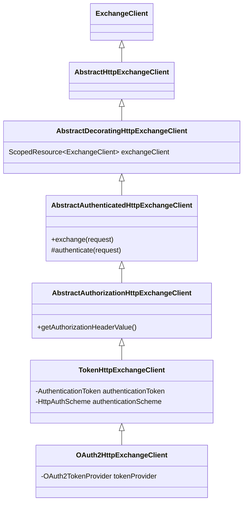
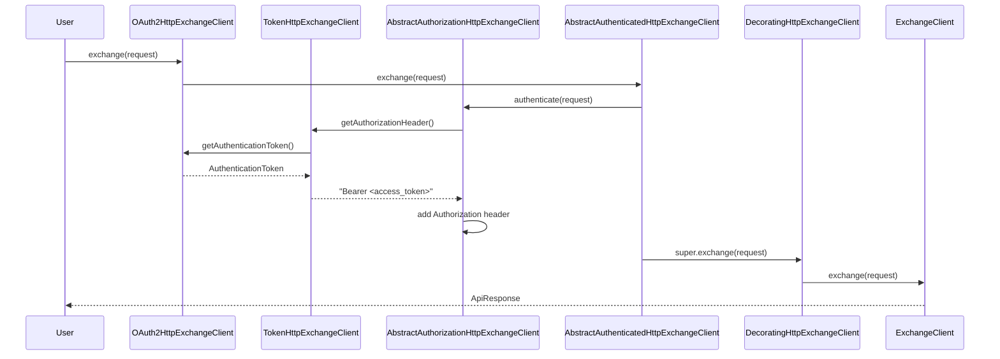

`OAuth2HttpExchangeClient` class hierarchy:

```mermaid

classDiagram
    direction TB

    ExchangeClient <|-- AbstractHttpExchangeClient
    AbstractHttpExchangeClient <|-- AbstractDecoratingHttpExchangeClient
    AbstractDecoratingHttpExchangeClient <|-- AbstractAuthenticatedHttpExchangeClient
    AbstractAuthenticatedHttpExchangeClient <|-- AbstractAuthorizationHttpExchangeClient
    AbstractAuthorizationHttpExchangeClient <|-- TokenHttpExchangeClient
    TokenHttpExchangeClient <|-- OAuth2HttpExchangeClient

    AbstractDecoratingHttpExchangeClient : ScopedResource~ExchangeClient~ exchangeClient
    AbstractAuthenticatedHttpExchangeClient : +exchange(request)
    AbstractAuthenticatedHttpExchangeClient : #authenticate(request)

    AbstractAuthorizationHttpExchangeClient : +getAuthorizationHeaderValue()

    TokenHttpExchangeClient : -AuthenticationToken authenticationToken
    TokenHttpExchangeClient : -HttpAuthScheme authenticationScheme

    OAuth2HttpExchangeClient : -OAuth2TokenProvider tokenProvider

```

`OAuth2HttpExchangeClient` exchange flow:

```mermaid

sequenceDiagram
    participant User
    participant OAuth2 as OAuth2HttpExchangeClient
    participant Token as TokenHttpExchangeClient
    participant Authz as AbstractAuthorizationHttpExchangeClient
    participant Auth as AbstractAuthenticatedHttpExchangeClient
    participant Decorator as DecoratingHttpExchangeClient
    participant Delegate as ExchangeClient

    User->>OAuth2: exchange(request)

%% Template method
    OAuth2->>Auth: exchange(request)
    Auth->>Authz: authenticate(request)

%% Authorization header construction
    Authz->>Token: getAuthorizationHeader()
    Token->>OAuth2: getAuthenticationToken()
    OAuth2-->>Token: AuthenticationToken
    Token-->>Authz: "Bearer <access_token>"

%% Header mutation
    Authz->>Authz: add Authorization header

%% Delegation
    Auth->>Decorator: super.exchange(request)
    Decorator->>Delegate: exchange(request)

    Delegate-->>User: ApiResponse

```