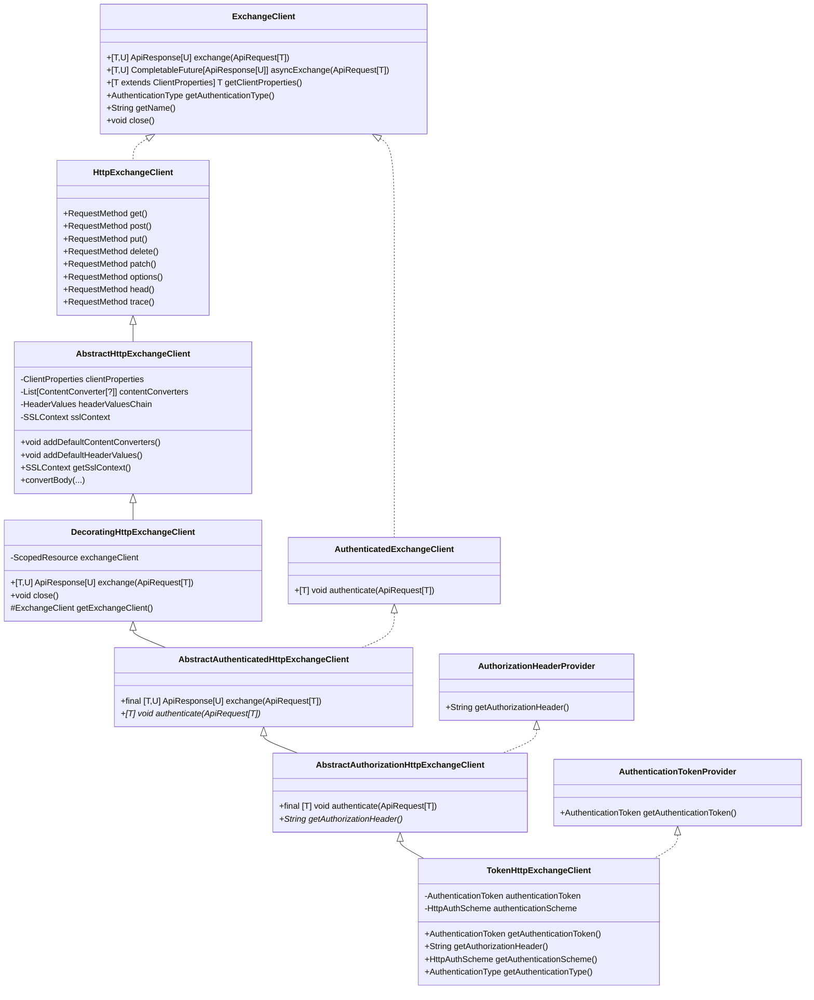
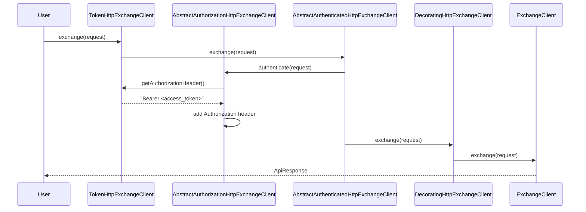

`TokenHttpExchangeClient` class hierarchy:

```mermaid
classDiagram
    direction TB

    ExchangeClient <|.. HttpExchangeClient
    ExchangeClient <|.. AuthenticatedExchangeClient

	HttpExchangeClient <|--  AbstractHttpExchangeClient
    AbstractHttpExchangeClient <|-- DecoratingHttpExchangeClient
    DecoratingHttpExchangeClient <|-- AbstractAuthenticatedHttpExchangeClient
    AbstractAuthenticatedHttpExchangeClient <|-- AbstractAuthorizationHttpExchangeClient
    AbstractAuthorizationHttpExchangeClient <|-- TokenHttpExchangeClient

    AuthenticatedExchangeClient <|.. AbstractAuthenticatedHttpExchangeClient
    AuthorizationHeaderProvider <|.. AbstractAuthorizationHttpExchangeClient
    AuthenticationTokenProvider <|.. TokenHttpExchangeClient

    class ExchangeClient {
        +[T,U] ApiResponse[U] exchange(ApiRequest[T])
        +[T,U] CompletableFuture[ApiResponse[U]] asyncExchange(ApiRequest[T])
        +[T extends ClientProperties] T getClientProperties()
        +AuthenticationType getAuthenticationType()
        +String getName()
        +void close()
    }

    class HttpExchangeClient {
        +RequestMethod get()
        +RequestMethod post()
        +RequestMethod put()
        +RequestMethod delete()
        +RequestMethod patch()
        +RequestMethod options()
        +RequestMethod head()
        +RequestMethod trace()
    }

    class AbstractHttpExchangeClient {
        -ClientProperties clientProperties
        -List[ContentConverter[?]] contentConverters
        -HeaderValues headerValuesChain
        -SSLContext sslContext
        +void addDefaultContentConverters()
        +void addDefaultHeaderValues()
        +SSLContext getSslContext()
        +convertBody(...)
    }

    class DecoratingHttpExchangeClient {
        -ScopedResource<ExchangeClient> exchangeClient
        +[T,U] ApiResponse[U] exchange(ApiRequest[T])
        +void close()
        #ExchangeClient getExchangeClient()
    }

    class AuthenticatedExchangeClient {
        +[T] void authenticate(ApiRequest[T])
    }

    class AbstractAuthenticatedHttpExchangeClient {
        +final [T,U] ApiResponse[U] exchange(ApiRequest[T])
        +[T] void authenticate(ApiRequest[T])*
    }

    class AuthorizationHeaderProvider {
        +String getAuthorizationHeader()
    }

    class AbstractAuthorizationHttpExchangeClient {
        +final [T] void authenticate(ApiRequest[T])
        +String getAuthorizationHeader()*
    }

    class AuthenticationTokenProvider {
        +AuthenticationToken getAuthenticationToken()
    }

    class TokenHttpExchangeClient {
        -AuthenticationToken authenticationToken
        -HttpAuthScheme authenticationScheme
        +AuthenticationToken getAuthenticationToken()
        +String getAuthorizationHeader()
        +HttpAuthScheme getAuthenticationScheme()
        +AuthenticationType getAuthenticationType()
    }

```

`OAuth2HttpExchangeClient` exchange flow:

```mermaid

sequenceDiagram
    participant User
    participant Token as TokenHttpExchangeClient
    participant Authz as AbstractAuthorizationHttpExchangeClient
    participant Auth as AbstractAuthenticatedHttpExchangeClient
    participant Decorator as DecoratingHttpExchangeClient
    participant Delegate as ExchangeClient

    User->>Token: exchange(request)

%% Template method
    Token->>Auth: exchange(request)
    Auth->>Authz: authenticate(request)

%% Authorization header construction
    Authz->>Token: getAuthorizationHeader()
    Token-->>Authz: "Bearer <access_token>"

%% Header mutation
    Authz->>Authz: add Authorization header

%% Delegation
    Auth->>Decorator: exchange(request)
    Decorator->>Delegate: exchange(request)

    Delegate-->>User: ApiResponse

```